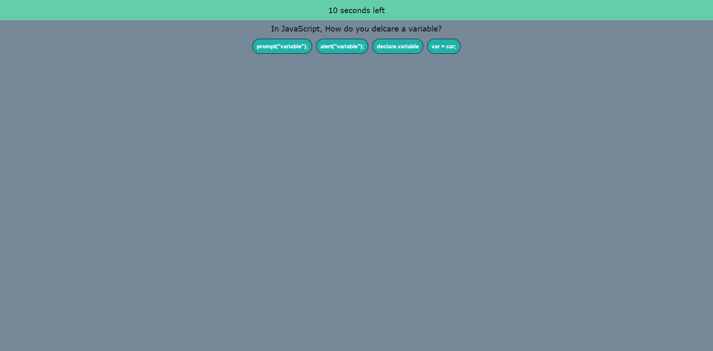

# Coding-Challenge

This coding quiz was created to help others who are new to learning how to code, test their knowledge on what they've learned so far along their coding journeys. When the user opens the site, they have a start button that they can click on to begin the quiz. The quiz is timed so it will keep track of how many seconds the user still has left or once the user completes all of the questions, the quiz will ask the user if they'd like to restart. 
[Check out the quiz here!](https://danacorona.github.io/Coding-Challenge/)

# Screenshots

